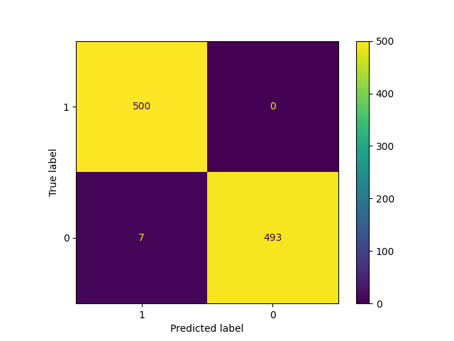

# Bank Marketing Campaign Analysis

## Description

The project focuses on analyzing and predicting the outcomes of direct marketing campaigns (phone calls) conducted by a Portuguese banking institution. The primary goal is to predict whether a client will subscribe to a term deposit based on various attributes.

## Abstract

The dataset is related to direct marketing campaigns of a Portuguese banking institution. The classification goal is to predict if the client will subscribe to a term deposit (variable y).

## Output Variable (desired target):

    y: Has the client subscribed to a term deposit? (binary: 'yes', 'no')

## Steps

1. **Dataset Selection and Preparation**: The dataset has been prepared for exploratory data analysis by handling any missing values, outliers, or other inconsistencies.
2. **Exploratory Data Analysis (EDA)**: A thorough EDA has been performed to gain a deep understanding of the dataset. This included analyzing the distribution of key features, identifying patterns or trends, and understanding the relationship between different variables.
3. **Preprocessing for Neural Network**: after that the data has been preprocessed for input into a neural network. This involved  normalizing or scaling the features and encoding categorical variables as necessary.
4. **Feature Engineering**: This involves transforming features using PCA, and reduce the number of features to minimize the computational load.
5. **Neural Network Development**: After choosing a specific number of features, a neural network model that can segment the market based on these features have been built. An appropriate architecture was chosen based on empirical experiments, considering the complexity of the data and the task at hand.
6. **Training and Evaluation**: Train the neural network on the prepared dataset and evaluate its performance using suitable metrics. The hyperparameters have been adjusted multiple times to improve the ability to segment the market accurately.


# Usage
## Data Preparation

The dataset is placed in the data/raw/ directory.

## Training the Model

Run src/main.py to execute the training pipeline.

```sh

python src/main.py
```
## Script Overview
- src/training/train.py

Contains the function train that orchestrates the training process. This includes initializing the model, defining the optimization criterion and optimizer, loading the data, and executing the training loop.
- src/main.py

Serves as the entry point for the model learning pipeline. It brings together all components of the project, including data loading, preprocessing, model training, and evaluation.
## Requirements

Install the required Python packages using the following command:

```
pip install -r requirements.txt
```
## Model Definition

The neural network model is defined in src/models/model.py. It consists of a sequential neural network with the following layers:

- Input layer with 14 features
- Two hidden layers with ReLU activation
- Output layer with Sigmoid activation

## Evaluation

After training, the model's performance is evaluated using metrics such as accuracy, precision, recall (sensitivity), specificity, and F1 score.

## Results
The result is visualized in the following confusion matrix figure:


The model has achieved an Accuracy of 99.3%, Precision 98.6%, Sensitivity_recall 100%, Specificity: 98.6%, F1-Score 99.3%.
